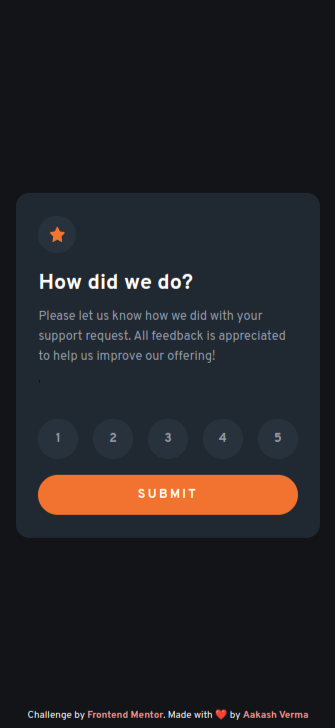
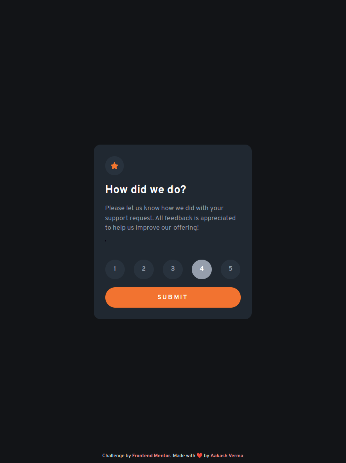
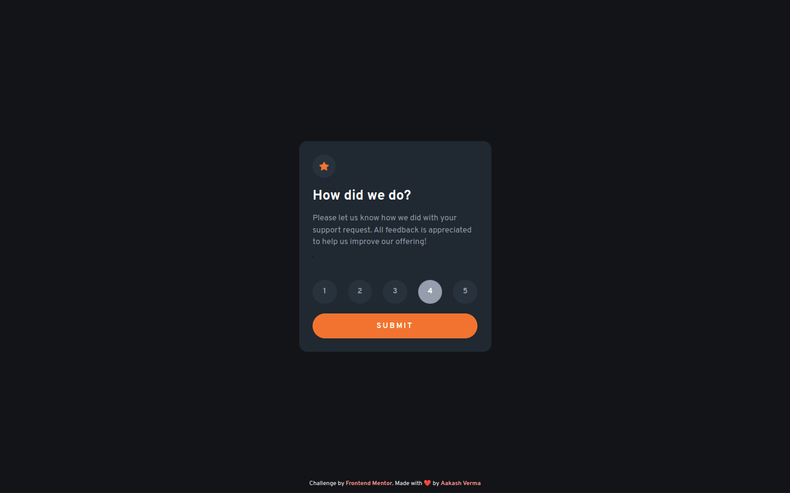

# Frontend Mentor - Interactive rating component solution

This is a solution to the [Interactive rating component challenge on Frontend Mentor](https://www.frontendmentor.io/challenges/interactive-rating-component-koxpeBUmI). Frontend Mentor challenges help you improve your coding skills by building realistic projects. 

## Table of contents

- [Overview](#overview)
  - [The challenge](#the-challenge)
  - [Screenshot](#screenshot)
  - [Links](#links)
- [My process](#my-process)
  - [Built with](#built-with)
  - [What I learned](#what-i-learned)
  - [Continued development](#continued-development)
  - [Useful resources](#useful-resources)
- [Author](#author)
- [Acknowledgments](#acknowledgments)

**Note: Delete this note and update the table of contents based on what sections you keep.**

## Overview

### The challenge

Users should be able to:

- View the optimal layout for the app depending on their device's screen size
- See hover states for all interactive elements on the page
- Select and submit a number rating
- See the "Thank you" card state after submitting a rating

### Screenshot

    <strong style="border: 4px solid; padding: 5px;">Mobile and Tablet solution</strong>
     
     
    
    

 
 

    <strong style="border: 4px solid; padding: 5px;">Design Vs My Output</strong>
     
     
    
    

### Links

- Solution URL: [GitHub](https://github.com/skyv26/interactive-rating-component)
- Live Site URL: [Github Pages Live](https://skyv26.github.io/interactive-rating-component/)

## My process

### Built with

- Semantic HTML5 markup
- CSS custom properties
- Flexbox
- Mobile-first workflow

### Continued development

React.js, Next.js

## Author

- Twitter - [vrma_aakash](https://twitter.com/vrma_aakash)
- Frontend Mentor - [@skyv26](https://www.frontendmentor.io/profile/skyv26)
- Github - [@skyv26](https://github.com/skyv26)